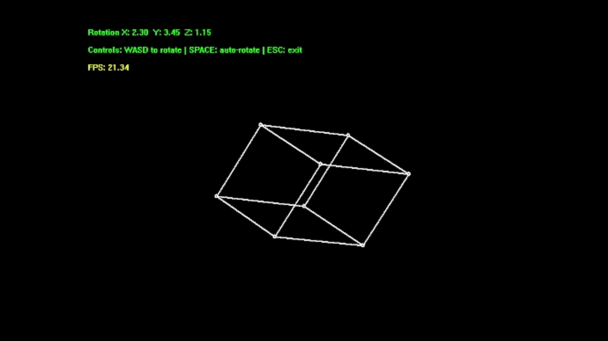

# 3DRenderer


### Meet Bob, He spins. 
No Libraries, Pre-conf's - Raw wireframed 3D rendering with GDI and Projection Mathematics.
```bash
  cd ~/3DRenderer/3DRenderer
  gcc 3DRenderer.cpp -o out && ./out
```
Should get you started, ik its a lot of 3DReNdErIng.

### Specs
Anything that can spit out 12 lines on a screen's good.

### Starting from Scratch 
  1. On the first day, God created a window (Win32) and 8 vector points representing each vertices of a Cube.
    - `createWindowEx()`, `showWindow()`, `updateWindow()` manages all the handles to the window. [more](https://learn.microsoft.com/en-us/windows/win32/learnwin32/creating-a-window)
    - 


