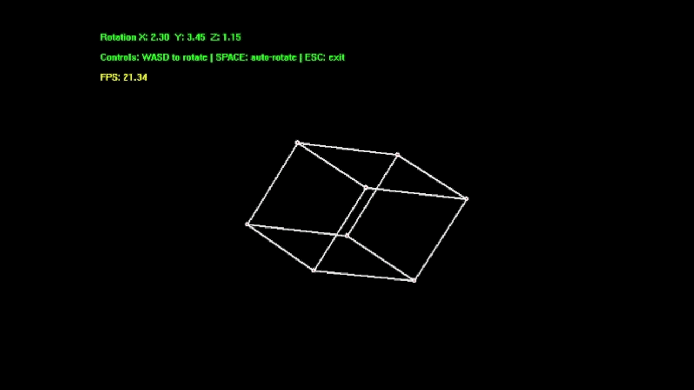

# 3DRenderer

### Meet Bob, He spins. 
No Libraries, Pre-config's - Raw wireframed 3D rendering with GDI and Projection Mathematics.
```bash
  cd ~/3DRenderer/3DRenderer
  gcc 3DRenderer.cpp -o out && ./out
```
Should get you started, ik its a lot of *3DReNdErIng*.
### Specs
Anything that can spit out 12 lines on a screen's good.

### Starting from Scratch 
  1. On the first day, God created a window (Win32) and 8 vector points representing each vertices of a Cube.
      - `createWindowEx()`, `showWindow()`, `updateWindow()` manages all the handles to the window. [ [more](https://learn.microsoft.com/en-us/windows/win32/learnwin32/creating-a-window) ].
      - The 8 points live in 3D space as `(x, y, z)` floats, centered on the origin like a cube that hasn't yet learned humility. No structs from a library, just a raw array because we're not animals who import things.

  2. On the second day, God said "let there be rotation," and so there was `sin()` and `cos()`, borrowed strictly from `<math.h>` because even God outsources trigonometry.
      - Each vertex gets multiplied through a rotation matrix on the X, Y, and Z axes, one frame at a time.<br> [ [Rotation matrix](https://en.wikipedia.org/wiki/Rotation_matrix) ] <br>
      *if you, too, forgot linear algebra*.
      - This is the part where Bob starts to feel something. We don't know what. We don't ask.

  3. On the third day, perspective projection was born, because a cube floating in true 3D space is useless to a 2D monitor that has never left flatland.
      - Every rotated 3D point gets squished into 2D using a basic perspective divide:<br> `x' = x * fov / (z + distance)` <br>
       [ [Perspective projection](https://en.wikipedia.org/wiki/3D_projection) ]
      - distance is just a fudge factor that keeps Bob from collapsing into a singularity on screen. Tune it until it looks less like abstract art.

  4. On the fourth day, the 12 edges of the cube were declared, connecting vertex to vertex like digital duct tape.
      - No mesh structure, no index buffers, just a hardcoded list of `{start, end}` pairs because Bob is a cube, not a Pixar movie.
      - Each edge gets drawn with `MoveToEx()` and `LineTo()`, GDI's way of saying "draw a line." [ [more](https://learn.microsoft.com/en-us/windows/win32/gdi/lines) ]

  5. On the fifth day, the render loop was created, and it was good, and it was also a `while(true)` with a `Sleep()` in it because we don't believe in delta time, we believe in vibes.
      - Each frame: clear the screen, rotate the points a little more, project them, connect the dots, repaint.<br> [ [Double buffering](https://learn.microsoft.com/en-us/windows/win32/gdi/double-buffering) ]
      - Without double buffering Bob doesn't so much "spin" as "seizure." Ask me how I know.

  6. On the sixth day, God looked at Bob, spinning gently in a wireframe void, and saw that it was good. Mostly.
      - No shading, no fill, no Z-buffering, no backface culling. Bob is a cube made entirely of trust and 12 lines.
      - If you want a cube with actual faces, that's tomorrow's problem. Bob doesn't have faces. Bob has *edges*, and edges are honest.

  7. On the seventh day, there was no rest, because the WndProc still needed a `WM_DESTROY` handler or the whole thing leaks like a screen door on a submarine. [WndProc and the Windows message loop](https://learn.microsoft.com/en-us/windows/win32/learnwin32/window-messages)

### Why
Because importing OpenGL felt like cheating, and watching `sin()` and `cos()` argue their way into a working cube felt like enlightenment.

### Known Issues
- Bob occasionally spins faster on faster machines, because frame-independent timing is a luxury we did not budget for.
- If you resize the window mid-spin, Bob may briefly become non-Euclidean. This is a feature.
- No, there's no anti-aliasing. Bob's edges are jagged and proud of it.

### Roadmap (lol)
- [ ] Z-buffering, so Bob can finally hide his back from you
- [ ] Filled triangles, so Bob can stop being a ghost
- [ ] More shapes than just a cube (a pyramid is on the whiteboard, has been for months)
- [ ] Mouse-controlled rotation, so you can spin Bob yourself instead of watching him do it alone

<br>
Do whatever you want with it. Bob just wants to spin in peace.
